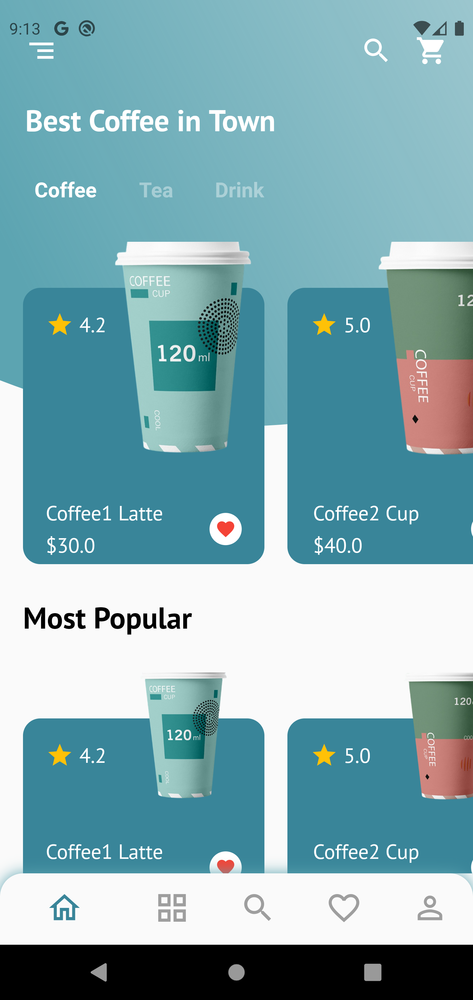
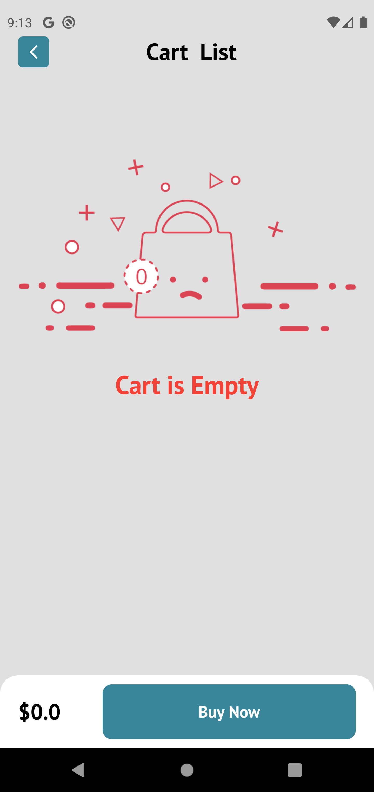
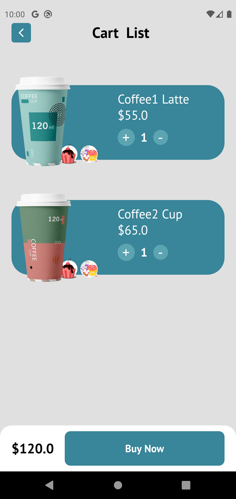
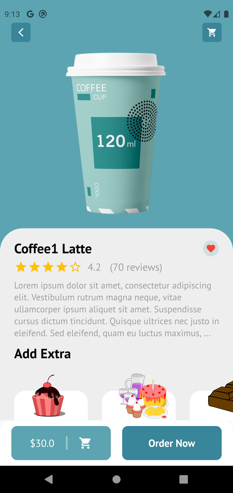
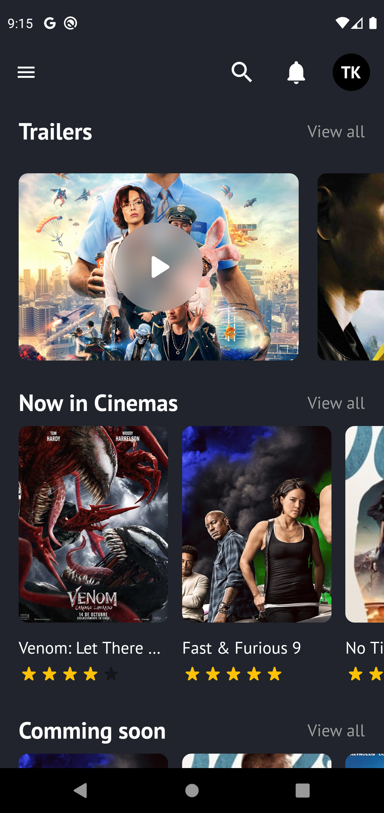
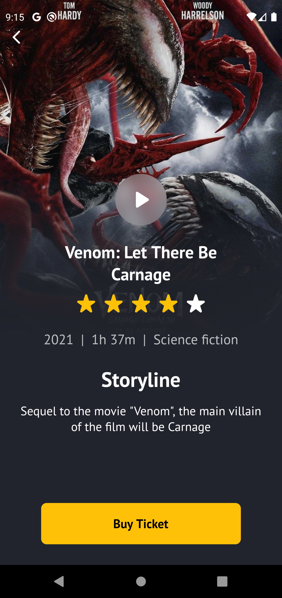
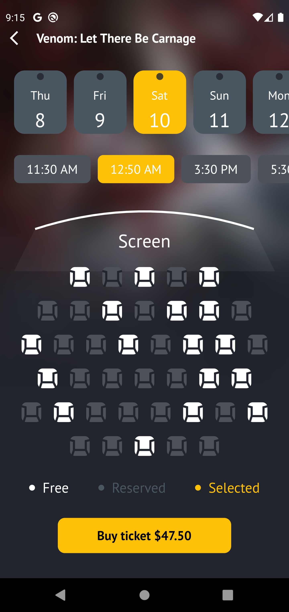
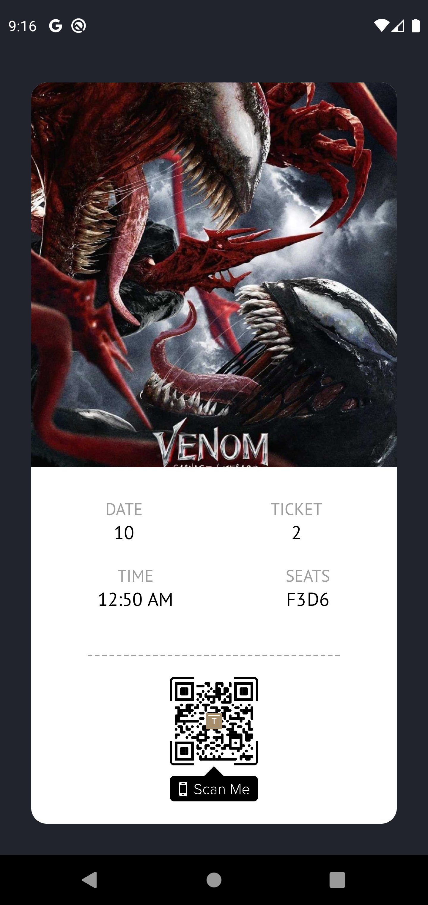

# Flutter - Projects - UI | TuanKieu

---
## APPs

## 01 - Coffee App 

<table border>
    <tr>
        <th style="text-align:center">Home Screen</th>
        <th style="text-align:center">Cart Screen</th>
        <th style="text-align:center">Cart Screen</th>
      <th style="text-align:center">Deatil Screen</th>
    </tr>
    <tr>
        <td></td>
        <td></td>
      <td></td>
      <td></td>
    </tr>
</table>

### [Copyright] (https://dribbble.com/shots/10756104-Coffee-Shop-Mobile-App)

## 02 - Cinema App 

<table border>
    <tr>
        <th style="text-align:center">Home Screen</th>
        <th style="text-align:center">Deatil Screen</th>
        <th style="text-align:center">Buy Ticket Screen</th>
        <th style="text-align:center">Pay Ticket Screen</th>
    </tr>
    <tr>
        <td></td>
        <td></td>
        <td></td>
        <td></td>
      
      
    </tr>
</table>

### [Copyright] (https://dribbble.com/shots/9527363-Movie-App/attachments/1554049?mode=media)
